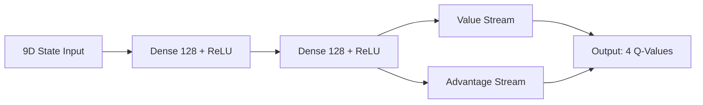

# 🚀 LunarLanderRL: Advanced Deep Reinforcement Learning

[](https://www.python.org/downloads/)
[](https://pytorch.org/)
[](https://gymnasium.farama.org/)

An ultra-modern reinforcement learning project featuring a custom **VastSpaceLander** environment and a sophisticated **DQN Agent** capable of atmospheric descent handling, fuel management, and precision landing.

---

## 🧠 Deep Q-Learning (DQN) Explained

### What is DQN?
Deep Q-Learning (DQN) is a Reinforcement Learning algorithm that combines **Q-Learning** with **Deep Neural Networks**. In standard Q-Learning, we maintain a table (Q-table) for every possible state-action pair. In complex environments like Lunar Lander, the state space is continuous and infinite, making a table impossible. DQN solves this by using a Neural Network as a function approximator to estimate the Q-values.

**The Goal**: Find a policy $\pi$ that maximizes the expected cumulative reward:
$$Q^\pi(s, a) = \mathbb{E} \left[ \sum_{t=0}^{\infty} \gamma^t r_t | s_0=s, a_0=a, \pi \right]$$

### How it Works (The Bellman Equation)
The agent learns by minimizing the difference between its current prediction and the "TD Target" (Temporal Difference):
$$\text{Loss} = \mathbb{E} \left[ (r + \gamma \max_{a'} Q(s', a'; \theta^-) - Q(s, a; \theta))^2 \right]$$

---

## 🏗️ Model Architecture & Structure

The project implements a modular **3-Layer Multi-Layer Perceptron (MLP)** with advanced architectural enhancements.

### 📐 State & Action Space
- **State Vector (9-Dimensional)**:
  1. `pos_x`, `pos_y`: Localized coordinates relative to the landing pad.
  2. `vel_x`, `vel_y`: Linear velocities.
  3. `angle`: Orientation of the lander.
  4. `angular_vel`: Rotation speed.
  5. `leg_1_contact`, `leg_2_contact`: Binary indicators (0/1).
  6. `fuel_level`: Remaining fuel percentage (Normalized).
- **Action Space (4-Discrete)**:
  - `0`: Do nothing.
  - `1`: Fire Left Engine.
  - `2`: Fire Main Engine.
  - `3`: Fire Right Engine.

### 🧬 Advanced DQN Variants
This project supports and implements:
1.  **Double DQN**: Decouples action selection from target evaluation to prevent overestimation bias.
2.  **Dueling DQN**: Splits the network into two streams:
    -   **Value Stream $V(s)$**: Estimating how good the state is.
    -   **Advantage Stream $A(s, a)$**: Estimating the relative benefit of each action.
    -   Combined via: $Q(s, a) = V(s) + (A(s, a) - \frac{1}{|A|} \sum A(s, a'))$



---

## 🚀 Training Mechanics

The training process is engineered for stability and fast convergence in a high-gravity, vast-landscape environment.

### 1. Experience Replay
We store the agent's experiences $(s, a, r, s', \text{done})$ in a **Replay Buffer** (Size: $10^5$). Every 4 steps, we sample a random minibatch of 128 experiences to break the temporal correlation of data, allowing the model to learn from past successes and failures multiple times.

### 2. Fixed Q-Targets & Soft Updates
To prevent the "chasing its own tail" problem where the target moves as the model updates, we use a separate **Target Network**.
- **Soft Update**: Instead of periodic hard resets, we use a smoothing parameter $\tau = 0.001$:
  $$\theta_{target} \leftarrow \tau \theta_{local} + (1 - \tau) \theta_{target}$$

### 3. Reward Shaping Logic
The reward function is heavily customized for the "Vast Space" environment:
- **Distance Penalty**: Penalizes distance from the landing pad.
- **Velocity Control**: Encourages slow, controlled descents.
- **Boundary Handling**: A massive **-2000 penalty** if the lander flies out of the simulation borders, teaching the agent strict spatial constraints.
- **Landing Bonus**: **+100** for a successful landing with both legs on the pad at safe speeds.

---

## 📁 Repository Structure

```bash
LunarLanderRL/
├── core/               # Engineering Core
│   ├── agent.py        # DQNAgent logic (Double/Dueling/Soft-Updates)
│   ├── model.py        # PyTorch Neural Network architecture
│   ├── game.py         # VastSpaceLander (Gymnasium Env Wrapper)
│   ├── memory.py       # Experience Replay Implementation
│   ├── constants.py    # Physics constants & Visual assets
│   └── renderer.py     # Custom PyGame Rendering engine
├── models/             # Trained Weights (.pth files)
├── results/            # Training Logs & CSV analysis
├── train.py            # Headless Training Script
└── main.py             # Live Demonstration / Playable Demo
```

---

## 🛠️ Getting Started

### Installation
```bash
pip install gymnasium[box2d] torch matplotlib tqdm pandas pygame
```

### Training the Agent
Run the training script in headless mode (optimized for servers):
```bash
python train.py --episodes 3000
```

### Watching the Demo
Watch the trained agent perform in the high-fidelity renderer:
```bash
python main.py
```

---

## 📝 License & References
Developed for Reinforcement Learning research. 
- Environment based on [Gymnasium LunarLander](https://gymnasium.farama.org/environments/box2d/lunar_lander/).
- DQN Theory based on [Mnih et al. (2015)](https://www.nature.com/articles/nature14236).
